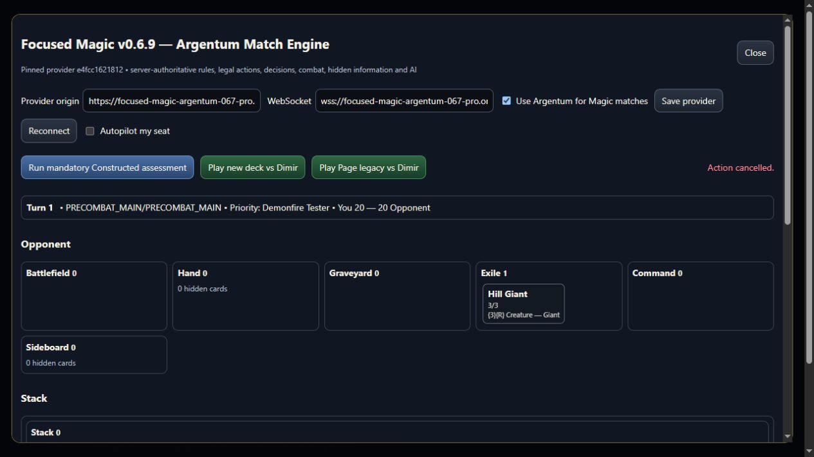

# Demonfire verification

Native DIS Demonfire has verified local gameplay and provider acceptance. Production deployment and full packet acceptance remain outstanding.

Paid X, actual damage and the death rider compose existing damage, conditions and grouping. Shared repairs add intrinsic conditional counter protection without activating battlefield grants on their own source spell; track resolving-spell damage; honor the rider in ordinary destroy/sacrifice movement; and clear history when a source becomes a new object. Same-zone/control moves and popped/resumed resolution retain it. SDK vocabulary is documented in the language reference.

## Validation

All 33 dedicated scenarios passed in the focused and full era runs: paid X/atomic rejection; lethal/later death and sacrifice; cleanup expiry; prevented, partially prevented, unpreventable and redirected damage; four counter destinations and actual Counterspell/draw responses; direct exile/invalid targets; blink/retrieval/recast; stack save/restore; copied spells and independent saved retargeting.

Two SDK, six intrinsic-protection, three death-transition and six object-history cases passed, plus three existing Sliver cases: 53 focused passes, zero failures/errors/skips. Exact scopes/timestamps are in demonfire-targeted-results.json.

The full gate passed in **1h35m51s**, across **20 modules: 19,727 passed, 24 skipped, zero failures/errors (19,751 total)**. Only the previously accepted :mtgish-tooling:test exclusion was used; unchanged tasks may reuse valid Gradle results. See demonfire-full-build-results.json. Native source remained unchanged during the successful full gate and browser acceptance.

Snapshot/lint passed in 4m40s (340 snapshot/round-trip and three lint cases), adding only Demonfire to DIS. Compiled metadata matches fresh Scryfall DIS collector 60, artist, Oracle text, rarity, image and zero official rulings; image HEAD 200. Earliest/scaffolded printing checks passed. Four later reprint sets are unscaffolded; no unsupported scaffold is claimed. See metadata/source/snapshot JSON records.

Fresh Assay confirms five grammar-covered DIS models with zero divergences; ten are not grammar-covered. Both Demonfire lines remain **DECLINED**, a coverage limitation, not a whole-card model pass. See demonfire-assay-verification.json and raw logs.

## Real provider acceptance

The dev API creates initial state only; casts, mana, targets and resolution then use normal commands. All 48 provider unit tests pass. The actual HTML X dialog rejects fractions/over-budget values and cancels without casting. Existing Engineered Explosives resolves at X=2 with two charge counters after black/red payment. Demonfire cancellation preserves its hand/stack; X=3 targeting Hill Giant taps four Mountains and resolves to opponent battlefield 0, graveyard 0, exile 1 (Hill Giant), with Demonfire in its owner's graveyard and an empty stack. Visible diagnostics prove the exile destination. See demonfire-provider-acceptance.json.

The static pin/configuration fields in this screenshot retain the old production defaults; the fixture explicitly connects to loopback 8083. This is local gameplay evidence, not deployment evidence. Modal, X-pay-life, combat, pending-decision controls and Constructed admission/start remain separate work.

## Failure history

Fixture compile errors, a first-test catalog initialization timeout, ordinary later-death failures, and recast history failure are preserved in demonfire-preserved-failures.json and the WIP chronology. Repairs did not relax assertions/timeouts. The first full gate failed at zero disk space. Redundant downloaded workspace installers and regenerable build-cache-1 were removed after stopping idle daemons, preserving source, compiled outputs, dependencies and records; the unchanged retry passed. No upstream write, new remote branch or deployment is claimed.
